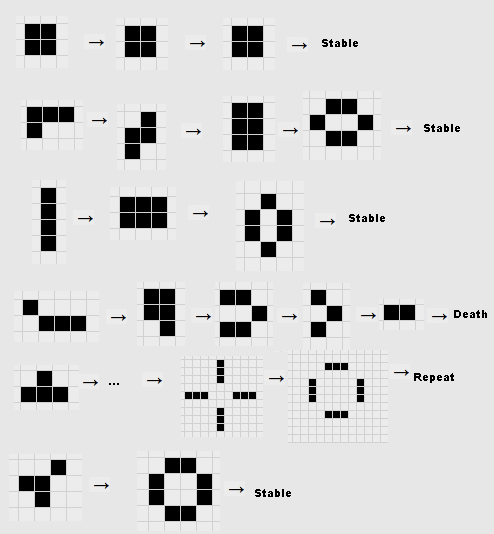

# Conway's Game of Life
This is a simple implementation of Conway's Game of Life in Python. It uses the pygame library to display the game and render the updates. 

## Usage
To run the game, simply clone this repository, run the following commands in the terminal:
```
pip install pygame
python gameOfLife.py
```
You start the game by clicking the space button. When you do, it switches the state of run to True which starts an infinite loop where the calculation functions are run. Before that, you can click on any tile and then it would be coloured black (to be alive) and if you click a live tile it would turn it back to dead, allowing you to start the initial conditions.

## Controls
* Left click to toggle a cell's state
* Press space to toggle the game's state (pause and unpause)
* Press 'r' to reset the game
* Press 'q' to quit the game

## Rules of the Game
The rules of the game are as follows:
* Any live cell with fewer than two live neighbours dies, as if caused by underpopulation.
* Any live cell with two or three live neighbours lives on to the next generation.
* Any live cell with more than three live neighbours dies, as if by overpopulation.
* Any dead cell with exactly three live neighbours becomes a live cell, as if by reproduction.

## References
To design this game, I relied heavily upon [this article's](https://levelup.gitconnected.com/game-of-life-on-python-6aaf5fd58ee3) instructions

## Stable Configurations
The following configurations are stable and evolve as indicated:
 